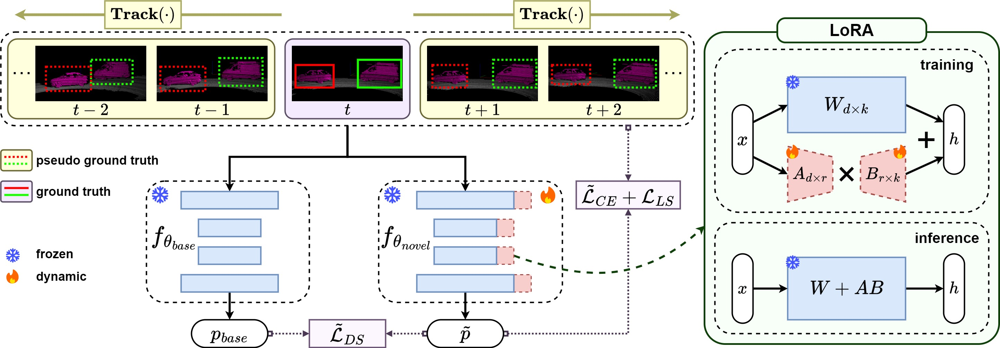
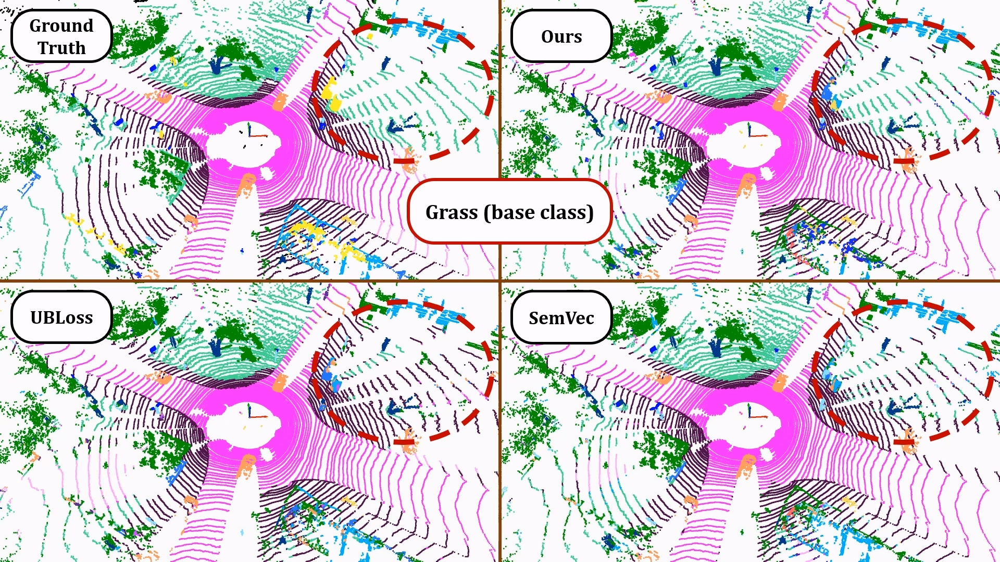
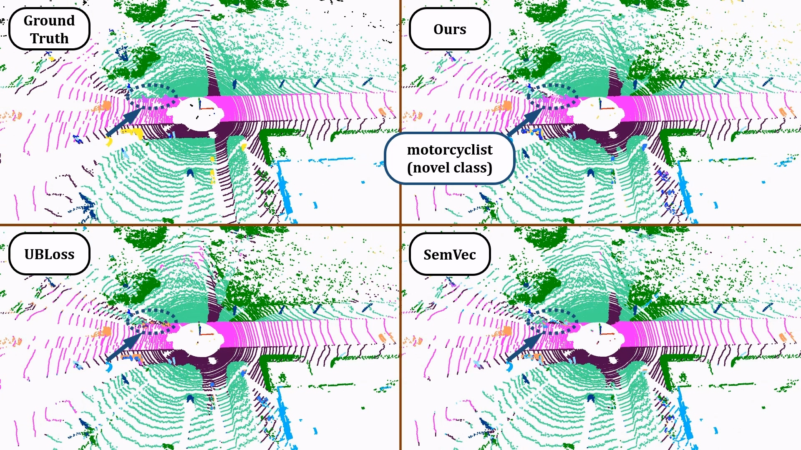

# TeFF: Tracking-enhanced Forgetting-free Few-shot 3D LiDAR Semantic Segmentation

## Abstract 

In autonomous driving, 3D LiDAR playing a crucial role in understanding the vehicle's surroundings. However, the newly emerged, unannotated objects presents few-shot learning problem for semantic segmentation. This paper addresses the limitations of current few-shot semantic segmentation by exploiting the temporal continuity of LiDAR data. Employing a tracking model to generate pseudo-ground-truths from a sequence of LiDAR frames, our method significantly augments the dataset, enhancing the model's ability to learn on novel classes. However, this approach introduces a data imbalance biased to novel data that presents a new challenge of catastrophic forgetting. To mitigate this, we incorporate LoRA, a technique that reduces the number of trainable parameters, thereby preserving the model's performance on base classes while improving its adaptability to novel classes. This work represents a significant step forward in few-shot 3D LiDAR semantic segmentation for autonomous driving.

## Method Overview



In novel data fine-tuning stage, we firstly track each ground truth with tracking model $\mathbf{Track}(\cdot)$, forwardly ($t+T$) and backwardly ($t-T$). The tracking results serve as pseudo ground truths and are combined with ground truths to supervise the novel model. We use unbias cross entropy $\tilde{\mathcal{L}}_{CE}$, unbias distillation $\tilde{\mathcal{L}}_{DS}$ and $\text{Lov}\acute{\text{a}}\text{sz}$ softmax loss $\mathcal{L}_{LS}$ to fine-tune the model. We further apply LoRA to novel model, which reduces the trainable parameters, thus achieving the goal of forgetting-free.

## Demo





## Setup Environment

```python
conda create --name teff python=3.9
conda activate teff
conda install pytorch=2.0.1 torchvision=0.15.2 torchaudio=2.0.2 pytorch-cuda=11.8 -c pytorch -c nvidia
conda install numpy matplotlib scipy scikit-learn tqdm pyyaml
pip install opencv-python tensorboard
```

## Generate Tracking Result

```bash
cd train_novel0
```

open [config/salsanext.py](train_novel0/tasks/config/salsanext.py), set `is_generate_extend_frame = True`, and then

```bash
./train.sh
```

## Training

```bash
cd train_novel0
./train.sh
```